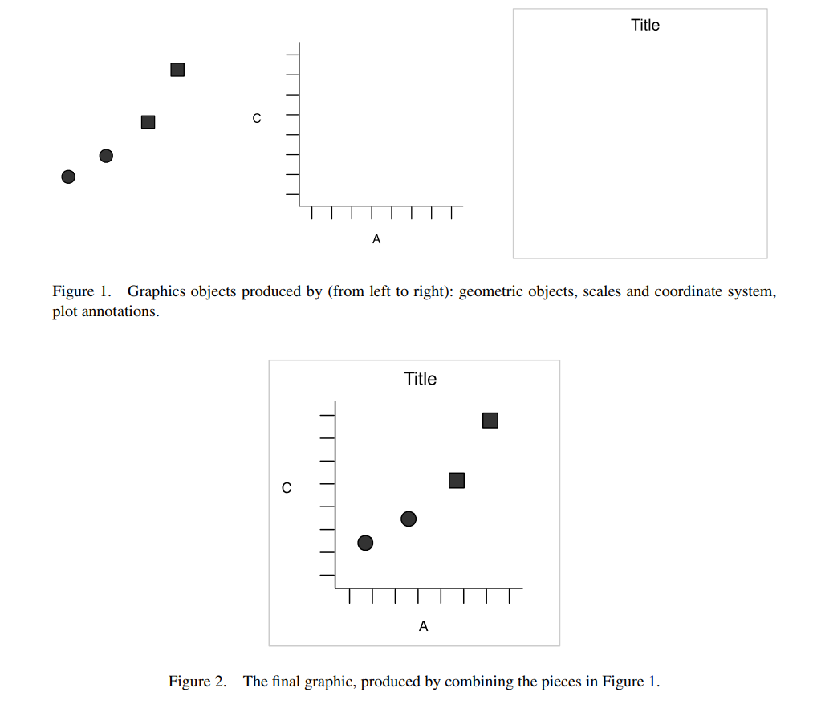
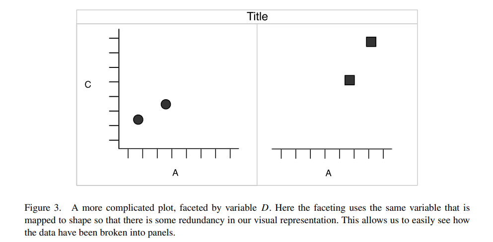

# Setup

Packages you will need:

```{r,message=FALSE, warning=FALSE}
library(tidyverse)
```

## Download the data

-   Click [here](https://opendata.camden.gov.uk/api/views/893b-tp33/rows.csv?accessType=DOWNLOAD&bom=true&format=true) to download the On_Street_Crime_In_Camden_Map.csv file we will use in this tutorial.

<!-- -->

-   If that does not work for some reason, go to the [On Street Crime In Camden Map dashboard](https://opendata.camden.gov.uk/Crime-and-Criminal-Justice/On-Street-Crime-In-Camden-Map/893b-tp33), click on **Export** (right-hand side menu) and download the "CSV for Excel" version of the data.

-   Save the CSV file on the same directory where you are running this notebook

## Read the data

```{r, message=FALSE, warning=FALSE}
df <- read_csv("On_Street_Crime_In_Camden_Map.csv")
```

**How many rows and columns?**

```{r}
dim(df)
```

**What does the data look like?**

```{r}
head(df)
```

**What are the data types?**

```{r}
str(df)
```

**Let's pre-process the \`Outcome Date\` column:**

```{r}
# Using dmy from the lubridate package (part of tidyverse)

df$`Outcome Date` <- lubridate::dmy(df$`Outcome Date`)


```

```{r}
#str(df)
```

**I am curious about the column `Category`, what are the most common categories?**

```{r}
knitr::kable(table(df$Category) %>% as.data.frame() %>% arrange(desc(Freq)))
```

```{r}
# This whole knitr::kable() thing is just to make the data look nicer here
knitr::kable(table(df$`Ward Name`) %>% as.data.frame() %>% arrange(desc(Freq)))
```

# The Grammar of Graphics

Let's make it visual!

Recommended reading: [📚 A Layered Grammar of Graphics - Hadley Wickham](https://vita.had.co.nz/papers/layered-grammar.pdf)

## What are the components of a plot?

[{fig-alt="Layers of a graph"}](https://vita.had.co.nz/papers/layered-grammar.pdf)

## Some named components:

-   data and aesthetic mappings,
-   geometric objects,
-   scales

## A bar plot

The code creates a bar plot:

```{r}
g <- ggplot(df, aes(x=Category)) + geom_bar() + coord_flip() 
  #theme(axis.text.x = element_text(angle=90))
g
```

-   `ggplot` initializes the plot for the data frame `df`

-   function `aes` maps the **aesthetics** of the graph

-   `geom_bar` is the **geometric object** we are using. You can consult the [geom_bar documentation](https://ggplot2.tidyverse.org/reference/geom_bar.html#aesthetics) to see which aesthetics it *understands*.

**🎯ACTION POINT: CUSTOMIZING THE PLOT**

-   Let's work on it together, how should we improve the bar plot?

```{r}
plot_df <- df %>% group_by(Category) %>% summarise(n=n())
plot_df
```

```{r}
plot_df$Category <- factor(plot_df$Category, levels=plot_df$Category)
```

```{r}
plot_df$Category
```

```{r}
g <- ggplot(plot_df, aes(x=Category, y=n, fill=n)) + 
  geom_col() #+ scale_x_discrete(breaks=plot_df$Category)
g
```

## An area bar

Using the grammar of graphics, you will often need to transform your data before you can create a plot.

For example, if you want to create an area bar in which we show number of crimes per day, we would first need to sum up the number cases.

```{r}
plot_df <- df %>% group_by(`Outcome Date`) %>% tally()

# This whole knitr::kable() thing is just to make the data look nicer here
knitr::kable(plot_df)
```

```{r}
g <- ggplot(plot_df, aes(x=`Outcome Date`,y=n)) + geom_area()
g
```

## The `fill` aesthetic

```{r}
# Let's recalculate the plot_df, this time summarising the data using two columns
plot_df <- df %>% group_by(`Outcome Date`, Category) %>% tally()
# This whole knitr::kable() thing is just to make the data look nicer here
knitr::kable(plot_df)
```

```{r}
g <- ggplot(plot_df, aes(x=`Outcome Date`, y=n, fill=Category)) + 
  geom_area() + scale_fill_discrete(guide="none") +
  
  theme_bw()
g
```

**🎯ACTION POINT: CUSTOMIZING THE PLOT**

-   Let's work on it together, how should we improve the bar plot?

```{r}

```

## Facets

If you want to break the plot into multiple subplots, you can use **facet**

{alt="Facets" fig-alt="Facets"}

**First let's summarise the data by Outcome Date, Category and Service**

```{r}
# Let's recalculate the plot_df, this time summarising the data using three columns
plot_df <- df %>% group_by(`Outcome Date`, Category, Service) %>% tally()
# This whole knitr::kable() thing is just to make the data look nicer here
knitr::kable(plot_df)
```

### Facet wrap:

```{r}
g <- ggplot(plot_df, aes(x=`Outcome Date`, y=n, fill=Category)) + 
  geom_area() + facet_wrap(Service ~ .)
g
```

### Facet grid:

```{r}
g <- ggplot(plot_df, aes(x=`Outcome Date`, y=n, fill=Category)) + 
  geom_area() + facet_grid(Service ~ .)

g
```

**🎯ACTION POINT: CUSTOMIZING THE PLOT**

-   Let's work on it together, how should we improve the bar plot?

```{r}

```

## 
