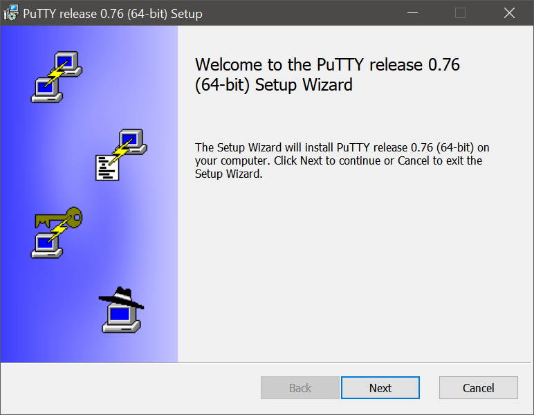
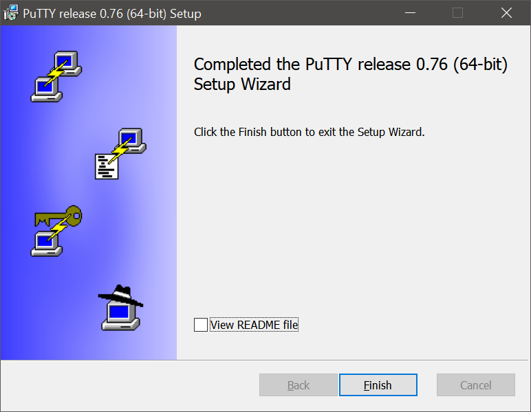
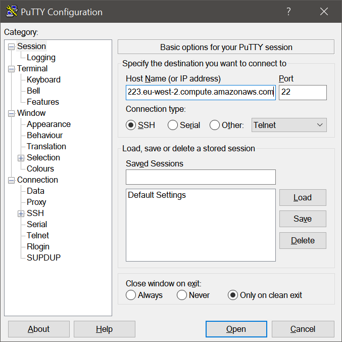
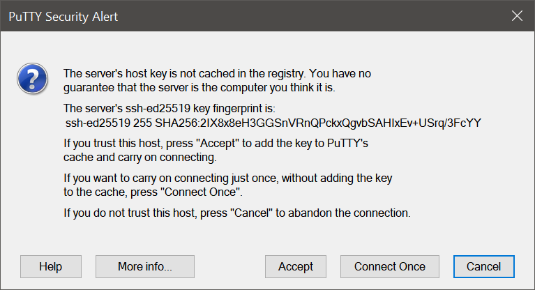
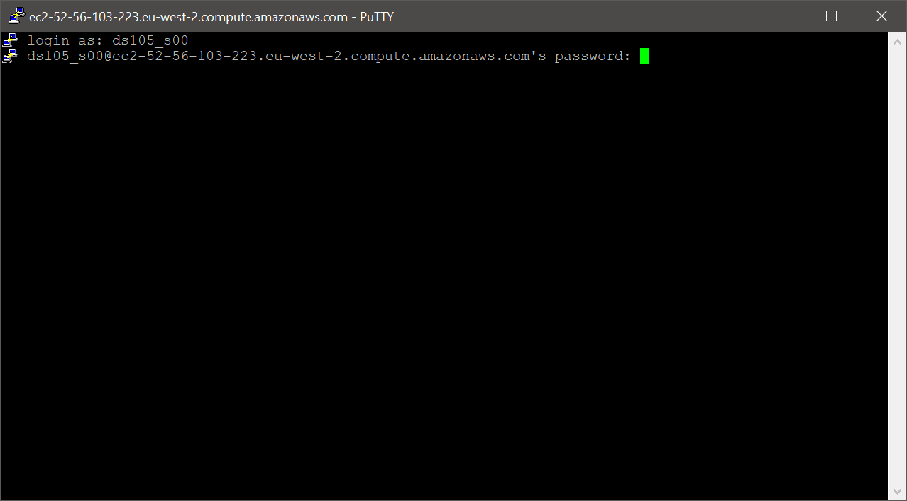
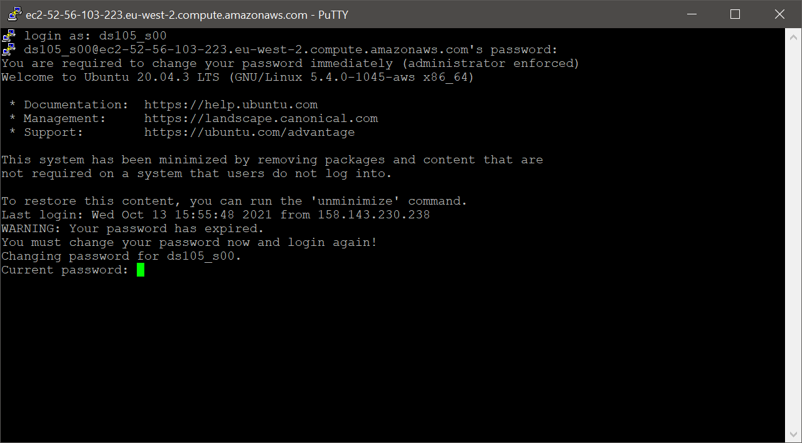
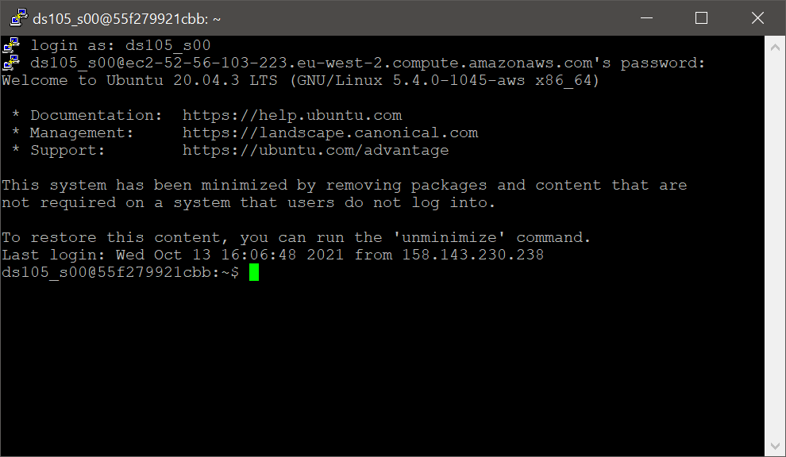
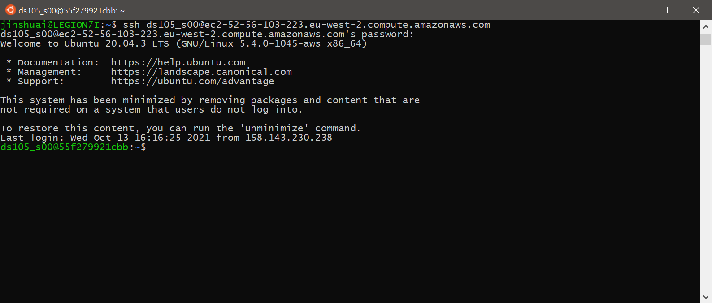

# Connect to DS105 cloud server

A cloud server has been setup for ds105 class. To connect to it, you need to setup a ssh connection.

There are many ssh clients. In this guide we will give some examples.

## Connect using PuTTY

PuTTY is a free SSH client. To use it, [download](https://www.chiark.greenend.org.uk/~sgtatham/putty/latest.html) and install on your system first.

Run the installer and follow the instructure to install it.





Launch the PuTTY program.



As shown in the image, add host name to the *Host Name* field.

The host address is:

> ec2-52-56-103-223.eu-west-2.compute.amazonaws.com

Then click open. And a security alert may be prompt up as following. 



Click accept. Then type your username and password in the command line window. 

You have be given a username, and the password is same as your username.



You will see the following message. The first time you login, you need to give a new password for your account. Type your current password and then make a new password as instructed. Note that it may fail to update the password because the password is too simple. Try to make more complex pattern in this case. It is recommended to have at least 8 characters with the combination of letters and numbers.



Note that once the password is updated, the connection will be closed and you need to reopen a connection use PuTTY. You will see the following screen once your login is succesful.



## Connect using command line

If you are using MacOS or WSL, you can connect to the server using the command line.

Open your terminal, and type the following command: 

```bash
# Replace <username> with your username
$ ssh <username>@ec2-52-56-103-223.eu-west-2.compute.amazonaws.com
```



The rest operation will be exactly the same as PuTTY.
