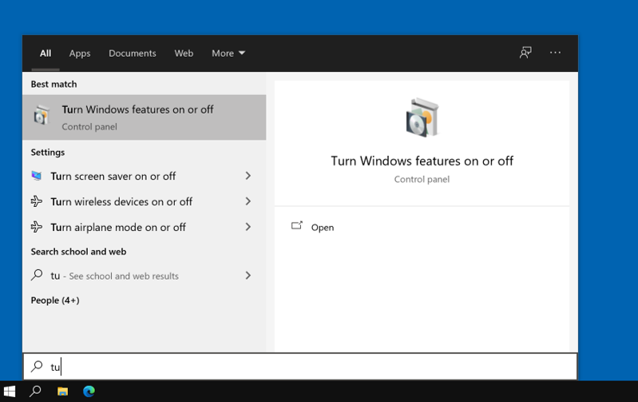
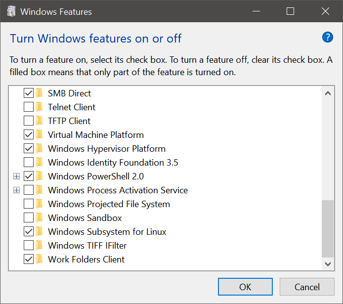
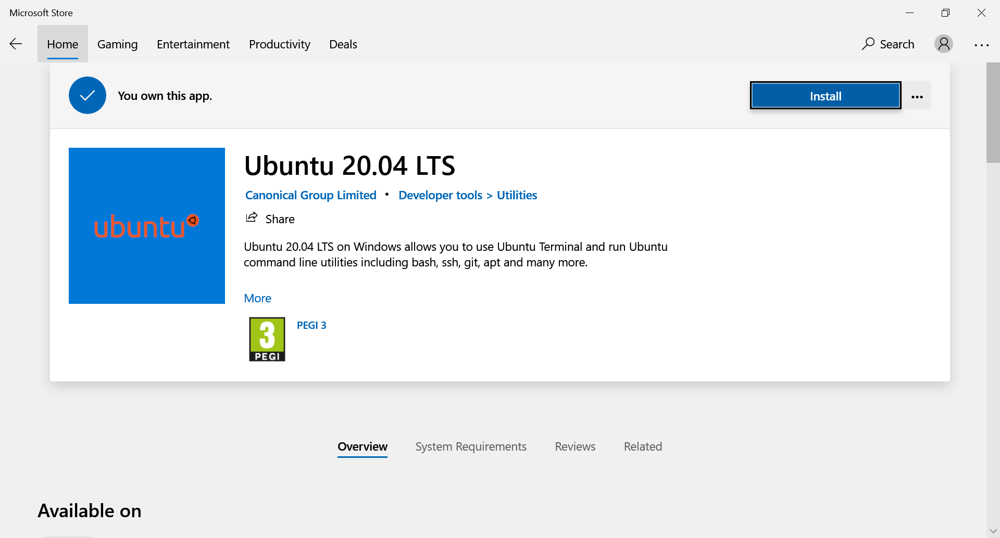
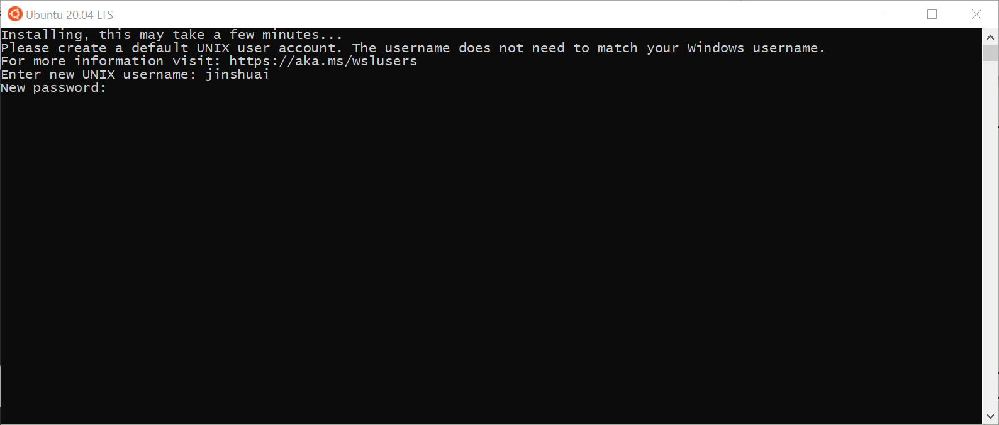
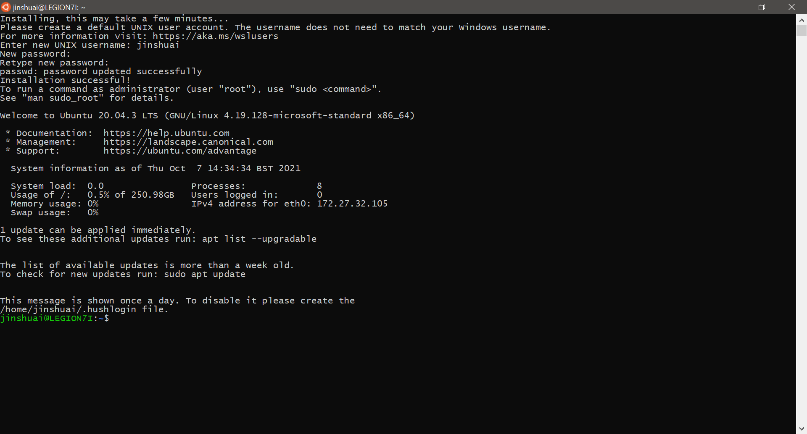

# Install Linux environment on Windows 10

Windows 10 comes with a built in feature called Linux Subsystem, which makes it eaiser to run linux environment on Windows system.

## Enable Windows Subsystem for Linux (WSL)

The feature needs to be enabled first in **Turn Windows features on or off**, which can be found by simply typing it in the search panel on task bar.

In the **Turn Windows features on or off** window, scroll down to find **Windows Subsystem for Linux** and select it. (A system reboot my be required for this)

## Install a Linux distribution

After WSL is enabled, you can search and install linux system images in Microsoft store.

There are many different linux distributions. In this example, we will use the **Ubuntu 20.04 LTS** image.

Click on **Ubuntu 20.04 LTS** and enter the app detail page. Then click on **install**. It may take a few minutes for the image to be downloaded and installed.

Once finished, click **launch**. WSL will be running as a terminal window, and the first time launching requires some addition operations like set username and password.

Be aware that the password won't be displayed in the window as you typing it.

You will see the following screen once the installation is successful.

Now you can try most of the basic linux commands here. Have fun!